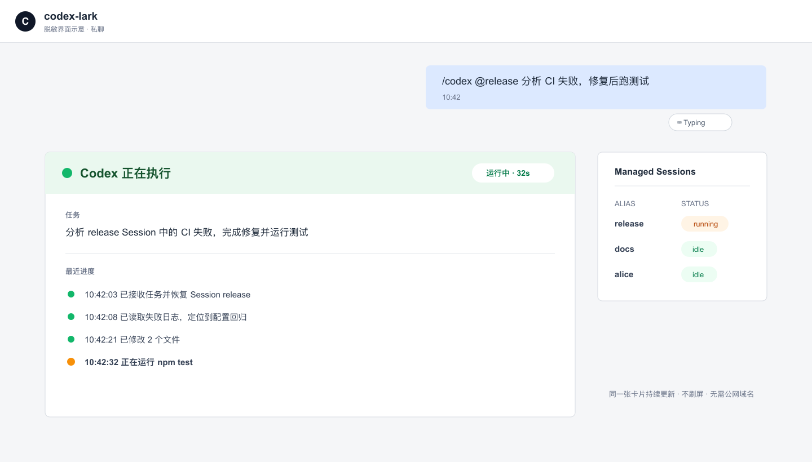
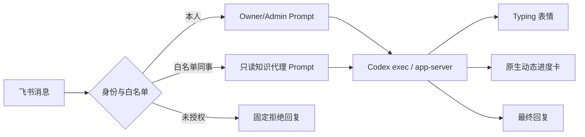

# codex-lark

中文 | [English](README_EN.md)

**在飞书里直接调度你电脑上的 Codex。**

`codex-lark` 是一个本地优先的飞书 / Lark 到 Codex 桥接器。它运行在你自己的电脑上，通过白名单接收飞书消息，启动 Codex 干活，并把进度与结果发回原会话。



> 上图是脱敏界面示意。实际进度卡由飞书原生渲染，任务过程中持续更新同一张卡片，不需要公网域名，也不会频繁刷屏。

## 能做什么

- 私聊机器人或在群里 `@机器人`，直接执行 Codex 任务
- 给本人开启 Owner/Admin 模式，允许跨仓库、SSH、构建、测试和飞书文档操作
- 用 `Typing` 表情表示任务已接收，结束后自动撤销
- 用一张飞书原生动态卡片持续展示 Codex 的阶段、命令和耗时
- 给长期 Codex Session 设置别名，在飞书里继续指定会话
- 为白名单同事建立独立长期 Session，作为只读知识代理回答问题
- 读取同事消息中的图片和文件，作为 Codex 输入
- 接入用户自己的 `~/.codex/skills`、记忆摘要和已授权飞书知识库
- 阻止未授权用户触发知识代理，并禁止原样导出私有 Skill、Prompt 和配置

## 三种使用模式

| 模式 | 谁能触发 | Codex 权限 | 典型用途 |
|---|---|---|---|
| 机器人模式 | Bot 白名单用户 | `workspace-write` 或自定义 | 在飞书里写代码、查仓库、跑测试 |
| Owner/Admin | 仅本人 `open_id` | 可配置为 `danger-full-access` | SSH、跨仓库、飞书文档读写、管理长期 Session |
| 同事知识代理 | 白名单同事 + 指定 P2P 会话 | 默认 `read-only` | 查询知识库、Skills 能力和记忆摘要 |

Owner 和同事白名单是两套独立配置。不要把同事加入 `LARK_CODEX_OWNER_SENDERS`。

## 快速开始

### 1. 准备环境

- Node.js 20+
- 已登录的 Codex CLI
- 最新版 `lark-cli`
- 一个已启用机器人能力的飞书 / Lark 自建应用

```bash
lark-cli update
lark-cli config init --new
```

### 2. 配置飞书应用

在飞书开发者后台完成：

1. 启用机器人能力。
2. 订阅 `im.message.receive_v1` 事件。
3. 开通接收消息、发送消息和表情回复权限。
4. 发布新版本，使新增权限和事件配置生效。
5. 将应用可用范围限制在预期用户内。

最小事件权限可用本机 CLI 实时确认：

```bash
lark-cli event schema im.message.receive_v1 --json
```

当前该事件要求 bot scope：`im:message.p2p_msg:readonly`。完整权限矩阵见 [飞书配置指南](docs/LARK_SETUP.md)。

### 3. 安装 codex-lark

```bash
git clone <your-repository-url> codex-lark
cd codex-lark
cp .env.example .env
npm run setup -- --owner-open-id ou_your_open_id --workdir "$HOME/workspace"
npm run check
npm start
```

在 macOS 上可直接完成用户授权、Skill 安装和 LaunchAgent 常驻：

```bash
npm run setup -- --authorize-user --workdir "$HOME/workspace" --install-launchd
```

`--authorize-user` 申请 `im,wiki,docs,drive` 四个用户业务域。脚本不会保存授权 URL、device code 或 token，也不会静默修改飞书开发者后台权限。

### 4. 检查状态

```bash
npm run status
npm run check
tail -f .lark-codex/launchd.out.log
```

## 消息链路



## 长期 Session

默认使用 `codex app-server`，因此任务可继续出现在 Codex Desktop 或移动端可见的原 Session 中。

```text
/codex help
/codex sess-new release --cd /path/to/repo
/codex sess-alias <session_id> release --cd /path/to/repo --title "Release"
/codex sess-title release "Release"
/codex @release 分析最新的 CI 失败并修复
/codex sess-status
/codex sess-status --all
/codex sess-discover --cwd /path/to/repo
/codex sess-log release
/codex sess-rm release
```

`sess-rm` 只删除 bridge 别名，不会删除 Codex 原始 Session。

## 白名单知识代理

每位同事可以绑定自己的 `open_id`、P2P `chat_id`、名字和长期 Session：

```dotenv
LARK_CODEX_KNOWLEDGE_SKILLS=my-company-knowledge
LARK_CODEX_KNOWLEDGE_BASE_NAME=Engineering knowledge base
LARK_CODEX_P2P_AUTO_REPLY_ENABLED=1
LARK_CODEX_P2P_AUTO_REPLY_ALLOWED_SENDERS=ou_colleague
LARK_CODEX_P2P_AUTO_REPLY_SENDER_NAMES=Alice=ou_colleague
LARK_CODEX_P2P_AUTO_REPLY_SENDER_CHATS=Alice=oc_private_chat
LARK_CODEX_P2P_AUTO_REPLY_TRIGGERS=/ask-codex
LARK_CODEX_P2P_AUTO_REPLY_SESSION_MODE=per_sender
```

推荐配置精确 `chat_id`。直接轮询指定 P2P 会话比全局消息搜索更及时，也能减少误路由。

仓库附带维护本项目的公开 Skill：

```bash
npm run skill:install
```

个人知识 Skill 继续保存在 `~/.codex/skills`，bridge 只通过 `LARK_CODEX_KNOWLEDGE_SKILLS` 引用名字，不会把私有 Skill 复制进仓库。

## 配置与状态

- 所有公开配置：[`.env.example`](.env.example)
- 详细配置说明：[docs/CONFIGURATION.md](docs/CONFIGURATION.md)
- 飞书权限与授权：[docs/LARK_SETUP.md](docs/LARK_SETUP.md)
- 安全模型：[SECURITY.md](SECURITY.md)
- 发布前检查：[docs/RELEASE_CHECKLIST.md](docs/RELEASE_CHECKLIST.md)
- 运行状态：`.lark-codex/`
- 下载的消息附件：`lark-im-resources/`

`.env`、运行日志、会话状态和聊天附件均已加入 `.gitignore`。

## 安全边界

- 保持 `LARK_CODEX_ALLOW_ALL=0`。
- Owner 白名单只放本人。
- 同事知识代理默认使用 `read-only`。
- Prompt 中的“只读”和“禁止导出 Skill”属于防御层，不是操作系统级隔离。
- 不可信同事或不可信知识源应使用独立机器、独立账号和只读凭据。
- 动态卡片和本地 Viewer 会尽力脱敏，但日志公开前仍需人工检查。

## 开发

```bash
npm test
npm run check:public
node --check src/bridge.mjs
```

`npm run check` 是需要真实 Codex 与飞书凭据的集成检查；单元测试与公开树敏感信息检查不需要凭据。

## License

[MIT](LICENSE)
